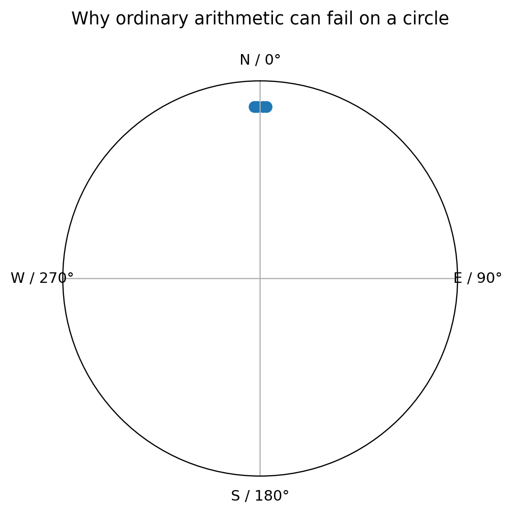
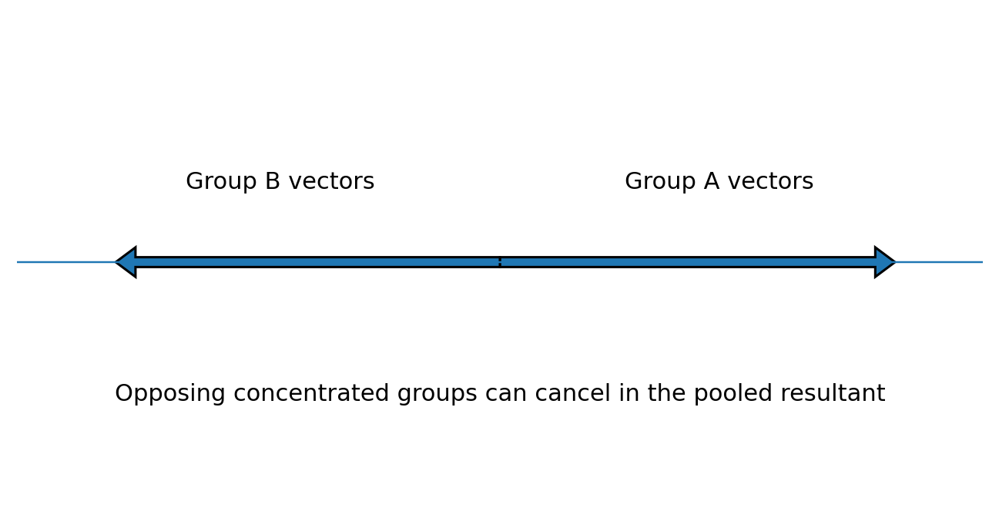

# Circular Statistics in Archaeoastronomy and Ethnoastronomy Using R

**SEAC 2026 Workshop - Participant Guide**

**Sunday, 16:00-20:00**

**Instructor:** Zlatko J. Kovačić

---

## How to use this guide

This is a **methods workshop supported by R**, not an R-programming course.

You are not expected to write statistical code from scratch. The workshop uses prepared, validated R scripts. Your job is to:

1. identify the research question;
2. run the relevant code block;
3. change only the parameters marked **CHANGE THIS**;
4. interpret the numerical and graphical result;
5. export the result reproducibly;
6. keep a record of the method and settings used.

The scripts repeatedly use three labels:

- **RUN THIS** - execute the code as supplied;
- **CHANGE THIS** - a safe parameter for guided experimentation;
- **INTERPRET THIS** - stop running code and explain what the output means.

The workshop folder is organised so that participants do not need to use `setwd()` or type Windows file paths manually.

---

## Schedule at a glance

| Time | Session | Main content |
|---|---|---|
| 16:00-16:50 | Session 1 | From ordinary statistics to circular data |
| 16:50-17:50 | Session 2 | Circular description and inference in R |
| 17:50-18:10 | Break | |
| 18:10-19:15 | Session 3 | Measurement uncertainty and curvigrams |
| 19:15-20:00 | Session 4 | Robustness, optional comparative example, AI as an R assistant, Curvigram Explorer |

If time becomes tight, Dataset 3 is the first element to shorten or move to a take-home exercise. Dataset 1 and Dataset 2 are the core of the workshop.

---

# 1. Before we start

## 1.1 What you need

The laboratory computers should already contain:

- R;
- RStudio Desktop;
- the `circular` package;
- `readr`, `dplyr`, `tibble`, `ggplot2`;
- `ragg` for high-resolution PNG export;
- `officer` and `flextable` for Word output.

Open:

```text
SEAC2026_Circular_Statistics.Rproj
```

Then use the Files pane in RStudio to open the participant scripts.

## 1.2 RStudio in five minutes

You mainly need four areas:

- **Source pane** - the R script you read and run;
- **Console** - where R prints results and errors;
- **Plots pane** - where graphs appear;
- **Files pane** - where workshop files and exported outputs can be found.

Run the current line or selected lines with:

```text
Ctrl + Enter
```

You do not need to type the commands again in the Console.

> **COMMON ERROR**
>
> If a script says that a file cannot be found, check that you opened `SEAC2026_Circular_Statistics.Rproj` first. Do not solve this by inserting a personal `setwd("C:/...")` command.

---

# 2. Circular data: the minimum vocabulary

## 2.1 Linear versus circular data

Ordinary linear data have two ends. A value near one end is far from a value near the other end.

Directions are different: after one complete turn the scale joins itself.

On a 0-360 degree scale:

```text
359 degrees and 1 degree are only 2 degrees apart.
```

That simple fact is why ordinary arithmetic can fail.



### The four-value example

Consider:

```text
358, 359, 1, 2 degrees
```

Ordinary arithmetic gives:

```text
mean = 180 degrees
```

But the observations are obviously concentrated around North, not South.

A circular mean correctly places the centre at approximately:

```text
0/360 degrees
```

> **WHAT DOES THIS MEAN?**
>
> Circular statistics do not merely use a different formula. They encode the geometry of the research variable.

---

## 2.2 Directional versus axial data

### Directional

A direction has a meaningful arrow.

Example:

```text
church entrance -> apse
```

An azimuth of 90 degrees is then different from 270 degrees.

### Axial

An axis has no meaningful arrow.

An axis at 20 degrees is equivalent to the same undirected axis at 200 degrees.

> **COMMON ERROR**
>
> Do not analyse axial observations as ordinary 0-360 degree directional data without an appropriate transformation.

---

## 2.3 Geographic azimuth convention

In this workshop:

```text
0 degrees   = North
90 degrees  = East
180 degrees = South
270 degrees = West
```

Angles increase clockwise.

In R we tell the `circular` package to use this convention:

```r
az <- circular(
  dat$azimuth_deg,
  units = "degrees",
  template = "geographics",
  modulo = "2pi"
)
```

---

# 3. Plot first, test second

A circular statistical test should never be the first thing you inspect.

Before calculating a p-value, ask whether the data appear:

- unimodal;
- bimodal;
- multimodal;
- almost uniform;
- dominated by a few isolated observations;
- concentrated across the 0/360 degree boundary.

The main introductory graph is a **rose diagram**.

```r
rose.diag(
  az,
  bins = 18,
  radii.scale = "sqrt"
)
```

Try more than one defensible bin count.

> **WHAT DOES THIS MEAN?**
>
> A visual feature that exists only under one convenient binning choice deserves less confidence than one that remains obvious across reasonable displays.

---

# 4. Circular descriptive statistics

## 4.1 Mean direction

The circular mean is the average direction around the circle.

Conceptually, imagine one unit arrow at every observed angle. Add the arrows. The direction of the resultant vector is the circular mean.

```r
mean_direction_deg <- as.numeric(mean(az)) %% 360
```

Report it in degrees when that is the natural unit for your field.

### Main caution

A single mean can be meaningless for a bimodal or multimodal distribution.

---

## 4.2 Mean resultant length: R-bar

The mean resultant length measures **net directional concentration**.

```r
Rbar <- rho.circular(az)
```

It ranges from approximately 0 to 1.

- nearer 1 -> stronger net concentration;
- nearer 0 -> weaker net concentration.

Do not impose arbitrary universal cut-offs such as “above 0.7 is strong”.

> **COMMON ERROR**
>
> R-bar near zero does not necessarily mean uniformity. Opposing clusters can cancel one another. Dataset 3 demonstrates this directly.

---

## 4.3 Circular variance

A simple circular variance is:

```text
V = 1 - R-bar
```

In R:

```r
circular_variance <- 1 - Rbar
```

- near 0 -> tighter concentration;
- larger values -> more dispersion.

---

## 4.4 Circular standard deviation

The workshop reports circular SD in degrees:

```r
circular_sd_deg <- sd(az) * 180 / pi
```

This gives an angular measure of dispersion that is easier to communicate to readers accustomed to degrees.

---

# 5. Confidence interval for the mean direction

A confidence interval describes the precision of the estimated population mean direction under the model/bootstrap procedure used.

The workshop uses:

```r
set.seed(2026)

mean_ci <- mle.vonmises.bootstrap.ci(
  az,
  alpha = 0.05,
  reps = 2000
)
```

The fixed seed makes the classroom exercise reproducible.

> **WHAT DOES THIS MEAN?**
>
> A narrow confidence interval says the sample gives relatively precise information about the mean direction. It does **not** say that an archaeological interpretation is certain.

---

# 6. Rayleigh test

The Rayleigh test is a useful first inferential method for a simple question about a **unimodal preferred direction**.

## Hypotheses

**H0:** directions are uniformly distributed around the circle.

**H1:** there is a unimodal directional concentration.

In R:

```r
rayleigh_result <- rayleigh.test(az)

Rbar <- rho.circular(az)
rayleigh_z <- length(az) * Rbar^2
rayleigh_p <- rayleigh_result$p.value
```

For ordinary workshop reporting:

- if `p < .05`, reject H0;
- if `p >= .05`, do **not** say that uniformity has been proved.

> **COMMON ERROR**
>
> Rayleigh is not a universal “random versus non-random” button. A strong bimodal or multimodal pattern can give a non-significant Rayleigh result.

---

# 7. Brief optional extension: the von Mises model

The von Mises distribution is a useful single-cluster model for circular data.

Its two intuitive parameters are:

- **mu** - the central direction;
- **kappa** - concentration around that direction.

```r
vm <- mle.vonmises(az)

as.numeric(vm$mu) %% 360
vm$kappa
```

Larger kappa indicates a tighter single cluster.

Use the optional script:

```text
01_WORKSHOP/01B_VonMises_OPTIONAL.R
```

> **COMMON ERROR**
>
> Do not force one von Mises model onto a clearly bimodal or multimodal sample.

---

# 8. Dataset 1 - circular-statistics fundamentals

Open:

```text
01_WORKSHOP/01_Dataset1_Circular_Statistics_BEGINNER.R
```

Exercise sheet:

```text
01_WORKSHOP/01_Exercise_Dataset1_Circular_Statistics.md
```

Dataset:

```text
02_DATA/01_orientation_basics.csv
```

## 8.1 Teaching scenario

The file contains 40 **synthetic** Orthodox-church orientations.

The longitudinal direction is defined:

```text
entrance -> apse
```

so the azimuth is directional.

The observations are designed to contain a clear easterly concentration, realistic dispersion and a few more strongly deviating orientations.

They are not measurements of real churches.

## 8.2 What you should obtain

| Statistic | Expected result |
|---|---:|
| n | 40 |
| Circular mean direction | about 98.49 degrees |
| R-bar | about 0.941 |
| Circular variance | about 0.059 |
| Circular SD | about 19.96 degrees |
| Rayleigh z | about 35.43 |
| Rayleigh p | < .001 |
| 95% bootstrap CI | approximately 93-105 degrees |

Small differences in bootstrap endpoints can occur across software/RNG implementations.

## 8.3 Interpretation

A suitable statistical interpretation is:

> The sample has a clear preferred direction broadly toward the east/east-southeast, with high but non-perfect directional concentration. The Rayleigh test provides strong evidence against circular uniformity under a unimodal alternative.

An unsuitable interpretation is:

> The test proves that all churches were deliberately astronomically aligned.

The statistics describe the sample. Archaeological interpretation still requires chronology, site context, topography, construction constraints, visibility and a plausible cultural mechanism.

## 8.4 Manuscript reporting model

The script generates a sentence of this form:

> The distribution of church orientations was significantly non-uniform, Rayleigh's z = 35.43, p < .001. The mean direction was 98.49 degrees (95% bootstrap CI [...], R-bar = .941, n = 40).

Add an archaeological qualification after the statistical sentence.

## 8.5 Files you export

The script creates:

```text
05_OUTPUT/Dataset1/
Dataset1_rose_diagram_300dpi.png
Dataset1_rose_diagram_600dpi.png
Dataset1_circular_statistics.docx
```

---

# 9. From measurement uncertainty to a curvigram

A histogram assigns observations to bins.

A curvigram instead lets every observation contribute a smooth local function - a **kernel** - and sums those local contributions.

The result is a continuous representation of where the observed values contribute most strongly.

The workshop uses a transparent implementation rather than a black-box smoothing command.

---

# 10. The kernel

For observation `i`:

```text
u = (x - x_i) / h_i
```

where:

- `x_i` is the observed declination;
- `h_i` is that observation's bandwidth.

The contribution is:

```text
K(u) / h_i
```

## 10.1 Epanechnikov kernel

Baseline:

```text
K(u) = 0.75 x (1 - u^2), if |u| <= 1
K(u) = 0,                otherwise
```

It has finite support.

## 10.2 Gaussian kernel

Sensitivity comparison:

```text
K(u) = exp(-u^2 / 2) / sqrt(2*pi)
```

Its tails decrease smoothly rather than stopping at a finite distance.

---

# 11. Bandwidth and reported uncertainty

The workshop rule is:

```text
h_i = multiplier x uncertainty_i
```

`uncertainty_deg` means the reported **plus/minus measurement uncertainty**.

We do **not** automatically assume that it equals one standard deviation.

## Default

```text
multiplier = 2
```

## Sensitivity logic

- multiplier 1 -> narrower kernels, sharper local features;
- multiplier 2 -> baseline;
- multiplier 3 -> stronger smoothing and greater merging.

> **WHAT DOES THIS MEAN?**
>
> Bandwidth is part of the statistical representation. Choosing it because one value creates an attractive peak is not a defensible research method.

---

# 12. Area-normalised density

The local kernel contributions are summed.

The workshop then numerically normalises the displayed curve so that:

```text
total displayed area = 1
```

This is the default curvigram scale.

The R script performs the trapezoidal integration explicitly, so you can see the calculation rather than trusting a hidden default.

---

# 13. Dataset 2 - curvigram and sensitivity analysis

Open:

```text
01_WORKSHOP/02_Dataset2_Curvigram_BEGINNER.R
```

Exercise:

```text
01_WORKSHOP/02_Exercise_Dataset2_Curvigram.md
```

Dataset:

```text
02_DATA/02_megalithic_curvigram.csv
```

## 13.1 Teaching scenario

The file contains 45 synthetic megalithic observations.

Each record contains:

- `declination_deg`;
- `uncertainty_deg`;
- simple contextual variables.

Declination is already calculated. The exercise does not teach the astronomical coordinate transformation itself.

## 13.2 Frozen baseline

```text
Variable:          declination_deg
Geometry:          linear
Kernel:            Epanechnikov
Bandwidth:         2 x uncertainty_deg
Vertical scaling:  area = 1
Range:             -45 to +45 degrees
Grid step:         0.05 degrees
```

## 13.3 Required sensitivity cases

```text
Epanechnikov x 1
Epanechnikov x 2   baseline
Epanechnikov x 3
Gaussian x 2
```

## 13.4 Expected robust feature

The global peak should remain approximately:

| Specification | Expected peak |
|---|---:|
| Epanechnikov x 1 | 23.15 degrees |
| Epanechnikov x 2 | 23.40 degrees |
| Epanechnikov x 3 | 23.10 degrees |
| Gaussian x 2 | 23.15 degrees |

The total variation in peak position is only about 0.30 degrees.

That is the deliberately robust feature.

## 13.5 Expected smoothing-sensitive feature

A smaller feature appears around +16 degrees.

Its approximate location is fairly stable, but its **visual separation** from the dominant concentration is not.

- Epanechnikov x 1 -> distinct minor peak;
- Epanechnikov x 2 -> still visible;
- Epanechnikov x 3 -> increasingly shoulder-like;
- Gaussian x 2 -> nearly merged into the rising slope.


> **WHAT DOES THIS MEAN?**
>
> The main +23 degree feature deserves more descriptive confidence than the smaller +16 degree feature because the major feature survives reasonable changes in smoothing.

## 13.6 What sensitivity analysis is - and is not

Sensitivity analysis asks whether your substantive conclusion survives reasonable analytical choices.

It is **not** itself a formal significance test.

Use the phrase:

> descriptively robust to the tested specifications

rather than:

> statistically significant because it survived smoothing.

## 13.7 Reporting model

A useful methods/results paragraph is:

> The declination distribution was examined using an area-normalised kernel curvigram. The baseline specification used an Epanechnikov kernel with observation-specific bandwidths equal to twice the reported plus/minus measurement uncertainty, evaluated from -45 degrees to +45 degrees at 0.05-degree increments. The dominant concentration occurred near +23.40 degrees. Across sensitivity analyses using uncertainty multipliers of 1-3 and a Gaussian kernel at multiplier 2, the global peak remained between approximately +23.10 degrees and +23.40 degrees. The main feature was therefore stable under the tested smoothing choices, whereas a smaller feature near +16 degrees was more sensitive to smoothing.

Then add:

> These statistical concentrations are not, by themselves, evidence of intentional astronomical targeting.

## 13.8 Files you export

```text
05_OUTPUT/Dataset2/
Dataset2_baseline_curve.csv
Dataset2_sensitivity_curves.csv
Dataset2_baseline_curvigram_300dpi.png
Dataset2_baseline_curvigram_600dpi.png
Dataset2_sensitivity_comparison_300dpi.png
Dataset2_sensitivity_comparison_600dpi.png
Dataset2_curvigram_results.docx
```

---

# 14. Optional Dataset 3 - when pooling hides structure

Open:

```text
01_WORKSHOP/03_Dataset3_Ethno_Comparison_BEGINNER.R
```

Exercise:

```text
01_WORKSHOP/03_Exercise_Dataset3_Ethno_Comparison.md
```

Dataset:

```text
02_DATA/03_ethno_directions.csv
```

This is a fictional ethnoastronomical example and introduces **no new major method**.

Two practices are individually very concentrated but point in approximately opposite directions.

Expected subgroup results:

| Group | Mean direction | R-bar | Rayleigh |
|---|---:|---:|---:|
| Morning-facing practice | about 84.25 degrees | about 0.992 | p < .001 |
| Evening-facing practice | about 265.05 degrees | about 0.988 | p < .001 |

Pooled:

```text
R-bar about 0.007
Rayleigh p about .998
```

The pooled rose diagram is nevertheless strongly bimodal.




> **WHAT DOES THIS MEAN?**
>
> A non-significant Rayleigh result does not prove uniformity. The vectors from two opposing concentrated groups can cancel in the pooled sample.

This is also a warning about data provenance. Before pooling archaeological or ethnographic observations, ask whether they genuinely represent the same:

- practice;
- population/community;
- period;
- season;
- ritual context;
- definition of direction;
- measurement protocol;
- source quality.

---

# 15. Cookbook: which method should I use?

| Research question | First workshop method |
|---|---|
| What does the directional pattern look like? | Rose diagram |
| What is the central direction? | Circular mean |
| How concentrated are the directions? | R-bar |
| How dispersed are they? | Circular variance / circular SD |
| How precise is the estimated mean direction? | Bootstrap CI |
| Is there evidence against uniformity for a unimodal alternative? | Rayleigh test |
| Is one bell-like circular model useful? | von Mises model |
| How can uncertain declinations be represented continuously? | Curvigram |
| Is a curvigram feature robust to smoothing choices? | Sensitivity analysis |
| Do subgroups look different? | Separate plots/summaries first; formal group tests are advanced |

Quick-reference sheet:

```text
04_REFERENCE/Which_Method_Should_I_Use.pdf
```

---

# 16. Exporting results for a report or manuscript

The workshop does not finish with an object sitting in the R Environment pane.

You will create:

- 300 dpi PNGs;
- 600 dpi PNGs;
- numerical CSV outputs;
- formatted DOCX result tables.

Why script the export?

Because the script records:

- exact width/height;
- resolution;
- file name;
- graph version;
- method used to generate it.

That is more reproducible than manually resizing an image in the RStudio Export window.

---

# 17. Minimum reporting standard

For circular orientation analysis, report as relevant:

- what the direction represents;
- directional versus axial treatment;
- angular convention;
- sample size;
- mean direction;
- R-bar;
- circular variance/SD;
- confidence interval;
- statistical test and hypotheses;
- software/package.

For a curvigram, additionally report:

- coordinate analysed;
- meaning of uncertainty;
- kernel;
- bandwidth rule;
- multiplier;
- vertical scaling;
- calculation range;
- calculation step;
- sensitivity cases.

> **COMMON ERROR**
>
> “We made a curvigram in R” is not a reproducible method description.

---

# 18. AI as an R assistant - approximately 15 minutes

The goal is not to ask AI to invent the analysis.

The safe workflow is:

```text
validated method -> validated R script -> small requested change -> human verification
```

Good uses:

- change titles/labels;
- change output dimensions;
- adapt column names;
- explain an error;
- explain a line of code.

Do not let an AI assistant silently change:

- circular versus linear treatment;
- directional versus axial treatment;
- degrees/radians;
- kernel;
- bandwidth;
- uncertainty meaning;
- normalisation;
- statistical test;
- filtering;
- significance level.

Use:

```text
04_REFERENCE/AI_R_Assistant_Prompt_Card.pdf
```

---

# 19. Curvigram Explorer - participant gift

After learning the transparent R calculation, you can use the **Curvigram Explorer** Shiny app to explore the same choices without rewriting the code.

**Live app:**

```text
https://statisticar-curvigram-explorer.share.connect.posit.cloud/
```

The app provides:

- built-in demo data;
- CSV upload;
- linear and circular geometry;
- Epanechnikov and Gaussian kernels;
- uncertainty-based or fixed bandwidth;
- multiplier controls;
- area-normalised, raw and maximum-normalised scaling;
- publication-quality PNG export;
- numerical curve export;
- circular descriptive statistics;
- Rayleigh test;
- manuscript-reporting example;
- help pages in English, Greek and Serbian-Latin.

The purpose of the app is to reduce coding friction after the workshop. It does not remove the need to understand the methodological choices.

---

# 20. Common errors and quick fixes

## “object not found”

Usually you skipped the line that creates the object.

**Fix:** rerun the current section from its beginning.

## “could not find function ...”

The package may not have been loaded.

**Fix:** rerun the package-loading section.

## “file does not exist”

The project root is probably wrong.

**Fix:** open `SEAC2026_Circular_Statistics.Rproj`.

## My plot looks different from the instructor's

Check:

- same dataset;
- same bin count;
- same kernel;
- same multiplier;
- same range;
- same grid step;
- same script version.

## My Rayleigh p-value is non-significant but the graph is clearly structured

Check whether the pattern is bimodal/multimodal. Dataset 3 shows why this can happen.

## My curvigram has many tiny peaks

Check whether the bandwidth is too small for the research purpose. Compare the required sensitivity settings before interpreting local features.

## I changed the code and now nothing works

Return to the original participant script. Make one change at a time.

---

# 21. Folder map

```text
SEAC2026_Workshop_v2/
|
|-- SEAC2026_Circular_Statistics.Rproj
|
|-- 01_WORKSHOP/
|   |-- SEAC2026_Workshop_Guide.pdf
|   |-- 01_Dataset1_Circular_Statistics_BEGINNER.R
|   |-- 01B_VonMises_OPTIONAL.R
|   |-- 01_Exercise_Dataset1_Circular_Statistics.md
|   |-- 02_Dataset2_Curvigram_BEGINNER.R
|   |-- 02_Exercise_Dataset2_Curvigram.md
|   |-- 02_Curvigram_Reporting_Template.md
|   |-- 03_Dataset3_Ethno_Comparison_BEGINNER.R
|   `-- 03_Exercise_Dataset3_Ethno_Comparison.md
|
|-- 02_DATA/
|   |-- 01_orientation_basics.csv
|   |-- 02_megalithic_curvigram.csv
|   `-- 03_ethno_directions.csv
|
|-- 03_SOLUTIONS/
|   `-- instructor/development files
|
|-- 04_REFERENCE/
|   |-- Circular_Statistics_Cheat_Sheet.pdf
|   |-- Which_Method_Should_I_Use.pdf
|   |-- Curvigram_Explained.pdf
|   |-- AI_R_Assistant_Prompt_Card.pdf
|   |-- Further_Reading.pdf
|   |-- BOOK/Tadic&Kovacic~Orientation.pdf
|   |-- POSTERS/Circular_Statistics_Cheat_Sheet_Poster.png
|   |-- POSTERS/SEAC2026_circular.pdf
|   |-- POSTERS/SEAC2026_method.pdf
|   |-- POSTERS/Which_Method_Should_I_Use_Poster.png
|   `-- PRESENTATION/SEAC2026_Circular_Statistics_Workshop_Slides.pptx
|
`-- 05_OUTPUT/
    |-- Dataset1/
    |-- Dataset2/
    `-- Dataset3/
```

Participants normally work only with `01_WORKSHOP`, `02_DATA`, `04_REFERENCE` and their own `05_OUTPUT` files.

---

# 22. After the workshop

A practical sequence is:

1. rerun Dataset 1 from a clean R session;
2. rerun Dataset 2 and reproduce all four sensitivity curves;
3. run the optional Dataset 3 example;
4. use Curvigram Explorer with the synthetic data;
5. adapt one validated script to a small dataset of your own;
6. use the AI prompt card for controlled code adaptation;
7. compare your output with the original working example;
8. retain the final script, data definitions and software information with your research files.

For additional applied R examples, the workshop recommends the instructor's book:

**Tadić, M. & Kovačić, Z. J. (2025). Astronomical orientation of medieval Orthodox churches and mosques (XV-XVI centuries) in former Yugoslavia – Circular statistical analysis in R.**

```text
𝐃𝐞𝐬𝐜𝐫𝐢𝐩𝐭𝐢𝐨𝐧
𝐀𝐬𝐭𝐫𝐨𝐧𝐨𝐦𝐢𝐜𝐚𝐥 𝐎𝐫𝐢𝐞𝐧𝐭𝐚𝐭𝐢𝐨𝐧 𝐨𝐟 𝐌𝐞𝐝𝐢𝐞𝐯𝐚𝐥 𝐎𝐫𝐭𝐡𝐨𝐝𝐨𝐱 𝐂𝐡𝐮𝐫𝐜𝐡𝐞𝐬 𝐚𝐧𝐝 𝐌𝐨𝐬𝐪𝐮𝐞𝐬 (𝐗𝐕–𝐗𝐕𝐈 𝐂𝐞𝐧𝐭𝐮𝐫𝐢𝐞𝐬) 𝐢𝐧 𝐅𝐨𝐫𝐦𝐞𝐫 𝐘𝐮𝐠𝐨𝐬𝐥𝐚𝐯𝐢𝐚: 𝐂𝐢𝐫𝐜𝐮𝐥𝐚𝐫 𝐒𝐭𝐚𝐭𝐢𝐬𝐭𝐢𝐜𝐚𝐥 𝐀𝐧𝐚𝐥𝐲𝐬𝐢𝐬 𝐢𝐧 𝐑 brings together astronomy, architecture, history, religion and statistics in a single interdisciplinary study. 
The book explores a deceptively simple question: 𝐖𝐞𝐫𝐞 𝐦𝐞𝐝𝐢𝐞𝐯𝐚𝐥 𝐬𝐚𝐜𝐫𝐞𝐝 𝐛𝐮𝐢𝐥𝐝𝐢𝐧𝐠𝐬 𝐨𝐫𝐢𝐞𝐧𝐭𝐞𝐝 𝐚𝐜𝐜𝐨𝐫𝐝𝐢𝐧𝐠 𝐭𝐨 𝐢𝐝𝐞𝐧𝐭𝐢𝐟𝐢𝐚𝐛𝐥𝐞 𝐚𝐬𝐭𝐫𝐨𝐧𝐨𝐦𝐢𝐜𝐚𝐥 𝐨𝐫 𝐫𝐞𝐥𝐢𝐠𝐢𝐨𝐮𝐬 𝐩𝐫𝐢𝐧𝐜𝐢𝐩𝐥𝐞𝐬, 𝐚𝐧𝐝 𝐡𝐨𝐰 𝐚𝐜𝐜𝐮𝐫𝐚𝐭𝐞𝐥𝐲 𝐜𝐚𝐧 𝐭𝐡𝐨𝐬𝐞 𝐩𝐚𝐭𝐭𝐞𝐫𝐧𝐬 𝐛𝐞 𝐦𝐞𝐚𝐬𝐮𝐫𝐞𝐝? 
The empirical analysis focuses on 𝟔𝟎 𝐢𝐦𝐩𝐨𝐫𝐭𝐚𝐧𝐭 𝐦𝐞𝐝𝐢𝐞𝐯𝐚𝐥 𝐎𝐫𝐭𝐡𝐨𝐝𝐨𝐱 𝐜𝐡𝐮𝐫𝐜𝐡𝐞𝐬 𝐚𝐧𝐝 𝟔𝟎 𝐧𝐨𝐭𝐚𝐛𝐥𝐞 𝐦𝐨𝐬𝐪𝐮𝐞𝐬 𝐟𝐫𝐨𝐦 𝐭𝐡𝐞 𝟏𝟓𝐭𝐡 𝐚𝐧𝐝 𝟏𝟔𝐭𝐡 𝐜𝐞𝐧𝐭𝐮𝐫𝐢𝐞𝐬 𝐢𝐧 𝐟𝐨𝐫𝐦𝐞𝐫 𝐘𝐮𝐠𝐨𝐬𝐥𝐚𝐯𝐢𝐚. The orientation of Orthodox churches is examined in relation to the eastern horizon and possible solar alignments, while mosque orientation is analysed in relation to the 𝐪𝐢𝐛𝐥𝐚 — 𝐭𝐡𝐞 𝐝𝐢𝐫𝐞𝐜𝐭𝐢𝐨𝐧 𝐨𝐟 𝐌𝐞𝐜𝐜𝐚. The book also compares mosque orientations in former Yugoslavia and Turkey and considers factors that may have affected historical measurement accuracy. 
A distinctive feature of the book is its use of 𝐜𝐢𝐫𝐜𝐮𝐥𝐚𝐫 𝐬𝐭𝐚𝐭𝐢𝐬𝐭𝐢𝐜𝐬, the branch of statistics designed specifically for angular and directional data. Rather than treating orientation values as ordinary linear measurements, the authors show how directional data should be visualised, summarised and statistically tested. 
The second major part of the book therefore functions as a practical introduction to 𝐜𝐢𝐫𝐜𝐮𝐥𝐚𝐫 𝐝𝐚𝐭𝐚 𝐚𝐧𝐚𝐥𝐲𝐬𝐢𝐬 𝐢𝐧 𝐑. It covers the R 𝑐𝑖𝑟𝑐𝑢𝑙𝑎𝑟 package, circular graphs and rose diagrams, kernel density estimation, circular means and dispersion, the von Mises distribution, Rayleigh and other uniformity tests, tests of mean direction and concentration, multi-group comparisons, and circular–linear and circular–circular association. 
The book combines 𝐫𝐞𝐚𝐥 𝐚𝐫𝐜𝐡𝐚𝐞𝐨𝐥𝐨𝐠𝐢𝐜𝐚𝐥 𝐚𝐧𝐝 𝐚𝐫𝐜𝐡𝐢𝐭𝐞𝐜𝐭𝐮𝐫𝐚𝐥 𝐝𝐚𝐭𝐚 𝐰𝐢𝐭𝐡 𝐬𝐭𝐚𝐭𝐢𝐬𝐭𝐢𝐜𝐚𝐥 𝐦𝐞𝐭𝐡𝐨𝐝𝐨𝐥𝐨𝐠𝐲, allowing readers to see how the methods work in an authentic research setting. Exercises and solutions further support self-study and teaching. 
It is intended for 𝐫𝐞𝐬𝐞𝐚𝐫𝐜𝐡𝐞𝐫𝐬, 𝐬𝐭𝐮𝐝𝐞𝐧𝐭𝐬 𝐚𝐧𝐝 𝐩𝐫𝐨𝐟𝐞𝐬𝐬𝐢𝐨𝐧𝐚𝐥𝐬 𝐢𝐧 𝐚𝐫𝐜𝐡𝐚𝐞𝐨𝐚𝐬𝐭𝐫𝐨𝐧𝐨𝐦𝐲, 𝐚𝐬𝐭𝐫𝐨𝐧𝐨𝐦𝐲, 𝐚𝐫𝐜𝐡𝐚𝐞𝐨𝐥𝐨𝐠𝐲, 𝐚𝐫𝐜𝐡𝐢𝐭𝐞𝐜𝐭𝐮𝐫𝐞, 𝐜𝐮𝐥𝐭𝐮𝐫𝐚𝐥 𝐡𝐞𝐫𝐢𝐭𝐚𝐠𝐞, 𝐠𝐞𝐨𝐠𝐫𝐚𝐩𝐡𝐲, 𝐡𝐢𝐬𝐭𝐨𝐫𝐲, 𝐫𝐞𝐥𝐢𝐠𝐢𝐨𝐮𝐬 𝐬𝐭𝐮𝐝𝐢𝐞𝐬, 𝐬𝐭𝐚𝐭𝐢𝐬𝐭𝐢𝐜𝐬 𝐚𝐧𝐝 𝐝𝐚𝐭𝐚 𝐚𝐧𝐚𝐥𝐲𝐬𝐢𝐬, as well as anyone interested in the relationship between sacred architecture and the sky.
```

For general circular statistics, see:

```text
04_REFERENCE/Further_Reading.pdf
```

---

# 23. Final take-home messages

1. **Directions are not ordinary linear numbers.**
2. **Plot first, test second.**
3. **A mean direction is meaningful only when the distribution supports that summary.**
4. **R-bar measures net concentration, not “randomness”.**
5. **A non-significant Rayleigh test does not prove uniformity.**
6. **Measurement uncertainty should be represented explicitly when the research question requires it.**
7. **A curvigram depends on kernel and bandwidth choices.**
8. **Sensitivity analysis tests robustness of interpretation, not formal significance.**
9. **A statistical peak is not proof of intentional astronomical targeting.**
10. **Use R and AI as transparent tools; retain methodological judgement yourself.**

---

## Reference sheets supplied with the workshop

- `Circular_Statistics_Cheat_Sheet.pdf`
- `Which_Method_Should_I_Use.pdf`
- `Curvigram_Explained.pdf`
- `AI_R_Assistant_Prompt_Card.pdf`
- `Further_Reading.pdf`

**End of participant guide**
